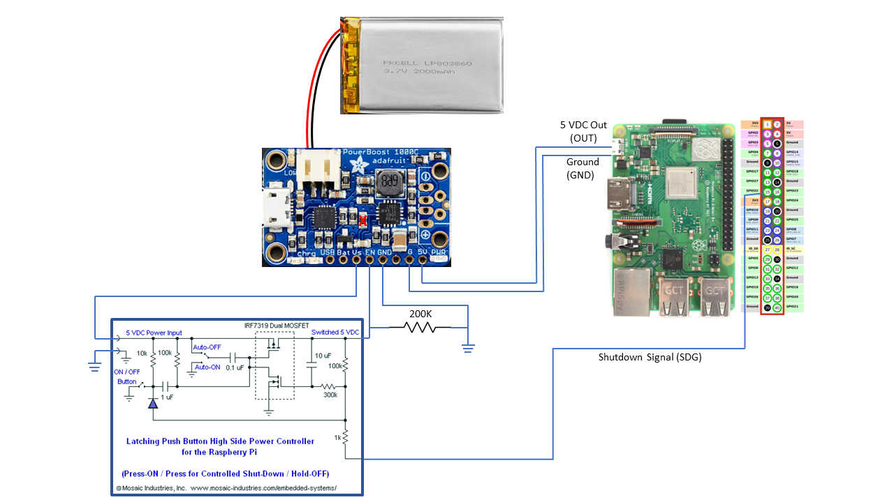

# pi-power-button

Scripts modified from Howchoo's official [Raspberry Pi power button guide](https://howchoo.com/g/mwnlytk3zmm/how-to-add-a-power-button-to-your-raspberry-pi).

The version of these scripts use systemd instead of System V init.

## Installation

1. [Connect to your Raspberry Pi via SSH](https://howchoo.com/g/mgi3mdnlnjq/how-to-log-in-to-a-raspberry-pi-via-ssh)
1. Clone this repo: `git clone https://github.com/richteel/pi-power-button.git`
1. Optional: Edit line 10 in pi-button-boot.py and line 11 in pi-button-shutdown.sh to your preferred pin
1. Run the setup script: `./pi-power-button/pi-button/install`

## Uninstallation

If you need to uninstall the power button script:

1. Run the uninstall script: `./pi-power-button/pi-button/uninstall`

## Hardware

The hardware for this switch is different than a simple switch used in Howchoo's design. This one uses the design presented by [Mosaic Industries](http://www.mosaic-industries.com/embedded-systems/microcontroller-projects/raspberry-pi/on-off-power-controller) to provide the following functionality.

- Button press to turn on
- Button press to signal to the device to shutdown
- Long button press to force power off
- Turn off power when the Raspberry Pi shuts down

A PCB to build the Mosaic Industries switch is available on OSH Park at [https://oshpark.com/shared_projects/Igqfdasg](https://oshpark.com/shared_projects/Igqfdasg)

Below is a diagram of the connections. Note the Adafruit 1000C is modified by removing R13 and connecting a 200K ohm resistor between enable (EN) and Ground. This modification is necessary to allow the switch to turn off the Powerboost 1000C.

## Next Steps ##

- Clean up the code now that it is working as expected
- Possibly have one script file to handle shutdown and listening for button press
- Determine how to make the Powerboost 1000C start from a powered off state

[Raspberry Pi pinout at pinout.xyz](https://pinout.xyz/)
